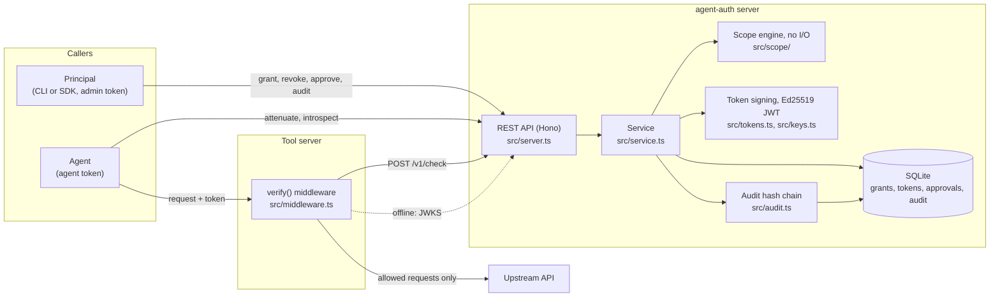
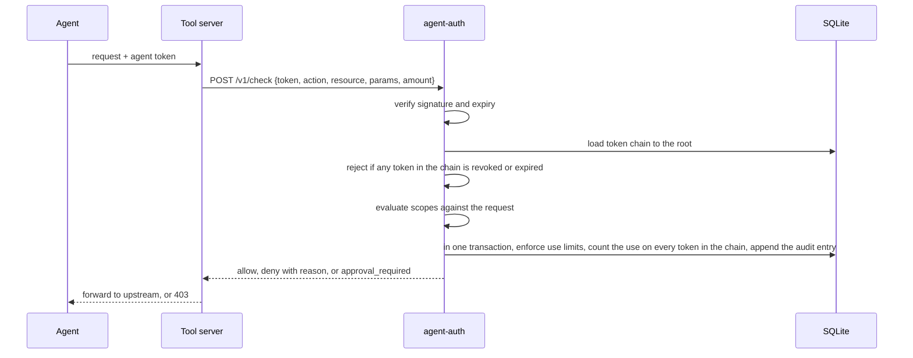

# Architecture

agent-auth is one process with one SQLite file. The same package provides the server, the CLI,
the SDK client and the tool-server middleware.

## Components

| Module | Responsibility |
| --- | --- |
| `src/scope/` | Parses scopes, matches requests and checks that a child scope set is covered by its parent. Pure functions, no I/O. |
| `src/service.ts` | Grants, tokens, checks, use counts, revocation, approvals and audit entries, in SQLite transactions. |
| `src/server.ts` | The REST API described by `openapi.yaml`. |
| `src/tokens.ts`, `src/keys.ts` | Signs and verifies tokens with an Ed25519 key that the server creates on first start. |
| `src/audit.ts` | Hashes each audit entry over the previous hash and verifies the chain. |
| `src/db.ts` | Opens SQLite with `better-sqlite3` on Node.js or `bun:sqlite` in the standalone executables, and installs the append-only triggers. |
| `src/middleware.ts` | `verify()` for Hono, `verifyNode()` for Connect-style servers, and the online and offline verifiers. |
| `src/client.ts`, `src/cli.ts` | The typed HTTP client and the `agent-auth` command built on it. |

## What happens on a check

A check writes its audit entry in the same transaction as the use count, so a decision is never
returned without a record of it.

## Design decisions

The [architecture decision records](/adr/) explain why the service works this way.
